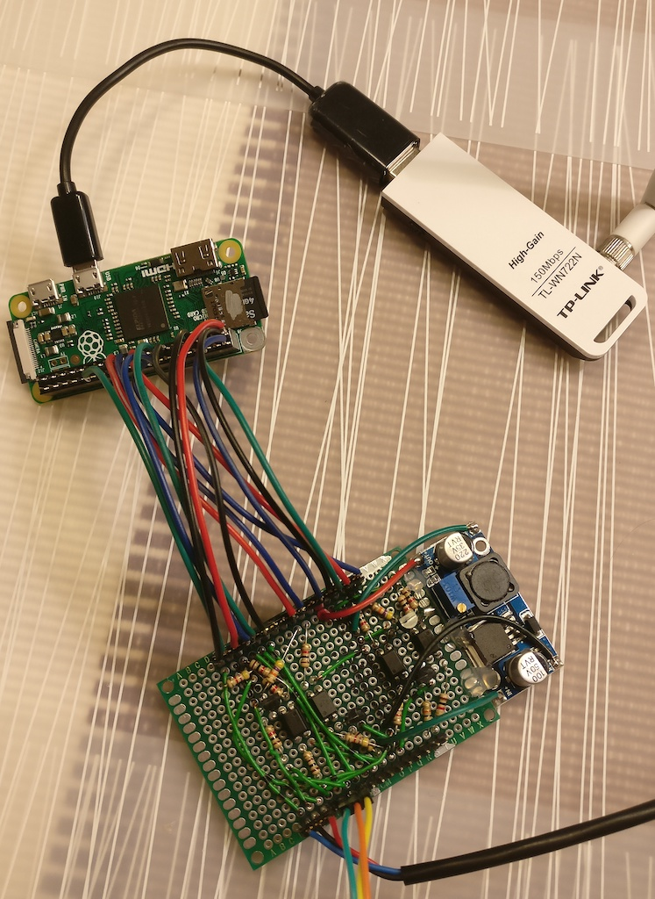
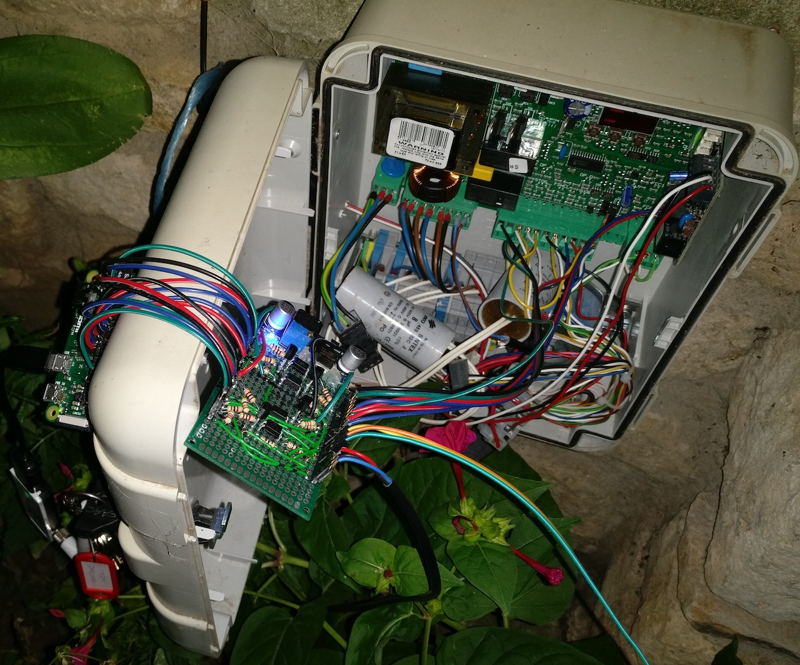

# Hoftor

(yep, again such a boring name) This was my first automation project.

We got an electric gate at home and when getting home from a tour on my motorcycle, it always
bothered me to stop in front of the gate, find the remote control in my jacket pocket with gloves
and open the gate with it. Then the waiting time until it was actually open, all very stupid. So I
decided to add wifi to the gate. Since Java was the only language I knew at the time, it was used.
(Even though I would do all this with an ESP today, it has been working for over 5 years now without
any problems).

With some basic electronic knowledge, I built an interface board between the gate electronics and a
raspberry pi zero. This provided an opto-isolated way to talk to the gates controller.

Some simple (and for sure not very nice) Java lines later, the tool was finished and offered a
Web-UI optimized for mobile devices, an HTTP API and a MQTT interface. I then
used [Tasker](https://play.google.com/store/apps/details?id=net.dinglisch.android.taskerm)
on my Android phone
with [AutoLocation](https://play.google.com/store/apps/details?id=com.joaomgcd.autolocation) to
build an automation which, once triggered, tracked the location of my phone and send an API request
to the gate once I got near to home.

After switching to iOS, which misses such great tools like Tasker, I built a Bluetooth headset into
my helmet and used Siri to trigger the gate API. Works fine, too.

The final build looks like this:

